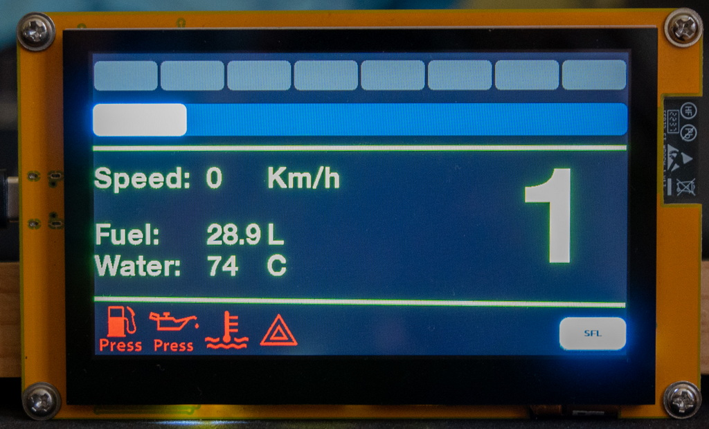

# iRDash_Client v3
Displays live data of iRacing telemetry using a touch sensitive TFT display.

## Gauges it can show
- RPM bar
- Eight segment Shift Light Indicator (blinking blue when limiter is active)
- Selected gear
- Fuel quantity
- Water temperature
- Speed
- Engine warning lights (Oil pressure, Fuel pressure, Water temperature, Stall)

## Supported cars
It supports multiple profiles to suit the different cars available in the sim. You can choose between them if you touch the profile name on the bottom right.
- Skip Barber (Skippy)
- Formula Renault 2.0
- Dallara Formula 3
- Super Formula Lights
- Cadillac CTS-V
- MX-5 (NC and ND)
- Toyota GR86
- BMW M2 CSR
- BMW M4 G82 GT4 evo  // updated for 2025 season 4
- Porsche 911 GT3 cup (992.1) // updated for 2024 season 4
- Porsche 911 GT3 cup (992.2)

## Display board
The program is developed on an ESP32-8048S043 display module:
- Size: 4.3"
- Resolution: 800x480
- Capacitive touch sensing
- Display driver IC: Sitronics ST7262
- Touch controller IC: Goodix GT911

## Arduino IDE settings
IMPORTANT!!! your program will not boot, instead it will continuously crash with not correct settings!
- Board: ESP32S3 Dev Module
- Flash mode: QIO 80Mhz
- Flash Size: 16 MB (128 Mb)
- PSRAM: OPI PSRAM

To compile the program you need the below libraries:
- ESP_Display_Panel v1.x https://github.com/esp-arduino-libs/ESP32_Display_Panel
- ESP32 core v3.x https://github.com/espressif/arduino-esp32
- LVGL v9.x https://github.com/lvgl/lvgl
- As a remark: Arduino GFX library (https://github.com/moononournation/Arduino_GFX) is not compatible with "ESP32 core library v3.x" when the display uses RGB interface. Displays with SPI or I2C interface are still working with Arduino GFX library.

## Telemetry source
To display the live data of iRacing it needs the "iRDash Server" program running on Windows host and connected to the Arduino board via USB.
- https://github.com/UmmonPwr/iRDash-Server

## Screenshot
